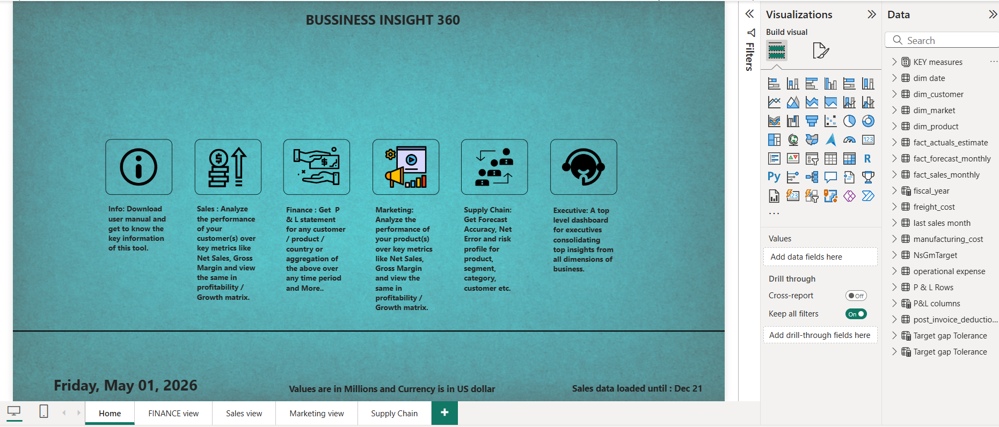
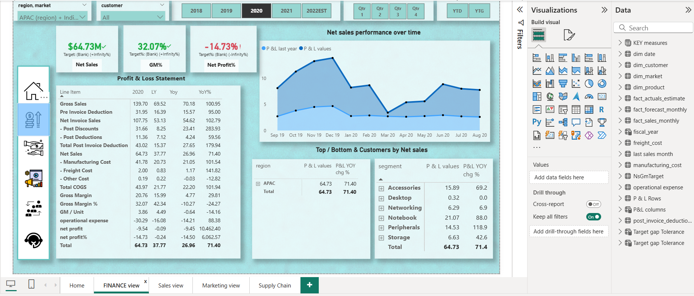
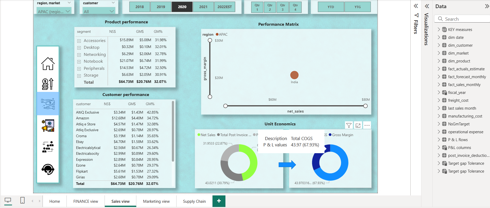
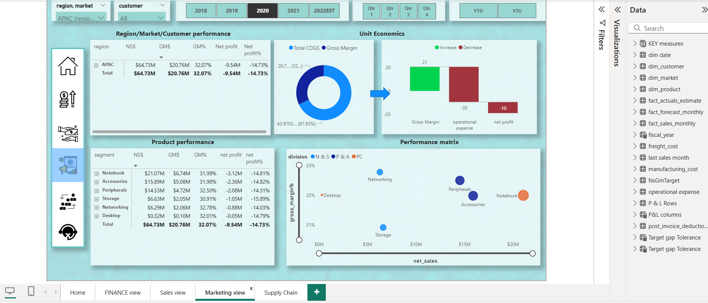
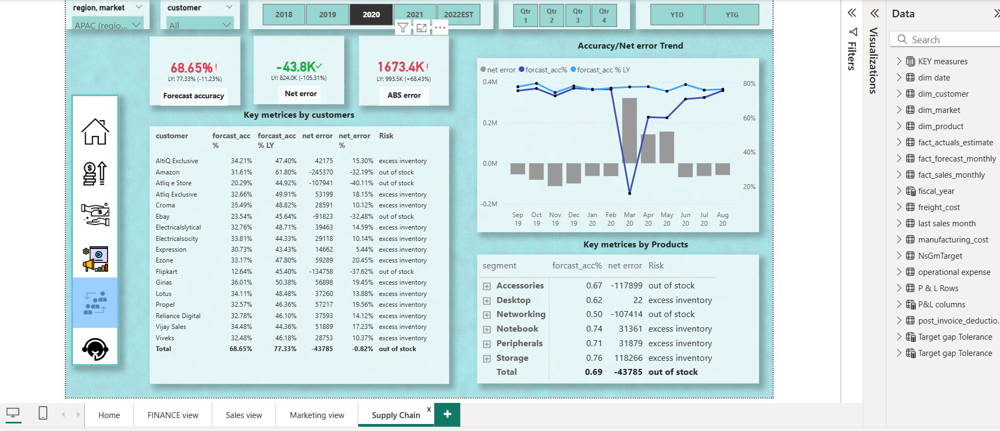

# 📊 Business Insight 360 – End-to-End Power BI Dashboard

## 🔍 Overview
This project is an end-to-end Business Intelligence solution developed using Power BI to analyze business performance across **Sales, Finance, Marketing, and Supply Chain** domains.

The dashboard is built on a dataset of **1.4M+ records**, integrating data from multiple sources including **Excel and SQL**. 
The project covers the complete ETL pipeline (data extraction, cleaning, transformation, and loading), data modeling, and dashboard development to deliver actionable insights.

---

## 🚀 Key Highlights
- Processed and analyzed **1.4M+ rows of data**
- Integrated data from **Excel files and SQL database**
- Performed **ETL using Power Query**
- Executed **data cleaning and transformation**
- Built **data model using Star Schema**
- Developed **DAX measures and KPIs**
- Designed **interactive multi-page dashboard**
- Enabled **dynamic filtering (Year, Region, Customer)**

---

## 📊 Dashboard Features

### 📌 Business Domains Covered
- Sales Analytics  
- Finance (P&L Analysis)  
- Marketing Insights  
- Supply Chain & Forecast Analysis  

### 📌 Key Metrics
- Net Sales  
- Gross Margin (GM%)  
- Net Profit  
- Forecast Accuracy  
- Net Error & ABS Error  

### 📌 Analysis Performed
- Customer Performance Analysis  
- Product Performance Analysis  
- Regional & Market Insights  
- Profitability Analysis (COGS vs Gross Margin)  
- Inventory Risk Analysis (Out of Stock / Excess Inventory)  

---

## 📸 Dashboard Preview

### 🏠 Home Page

### 💰 Finance View

### 📈 Sales View

### 📣 Marketing View

### 🚚 Supply Chain View

---

## 🛠️ Tools & Technologies
- Power BI  
- Power Query (ETL)  
- DAX (Data Analysis Expressions)  
- SQL  
- Excel  

---

## 📈 Business Impact
- Identified **profit leakage and cost inefficiencies**
- Improved visibility into **sales and financial performance**
- Detected **forecast inaccuracies impacting inventory planning**
- Highlighted **top-performing products and customer segments**

---

## 📁 Project Files
- Power BI Dashboard (.pbix) – 
https://drive.google.com/file/d/1g3fhxkLPzbAZ1rKGzTjDh3nICDmvQ2X6/view?usp=sharing

---

## 🎯 Skills Demonstrated
- Data Cleaning & Transformation  
- Data Modeling & Relationship Building  
- DAX & KPI Development  
- Dashboard Design & Data Visualization  
- Business Insight Generation  

---

## 👤 Author
Shivansh Srivastava
